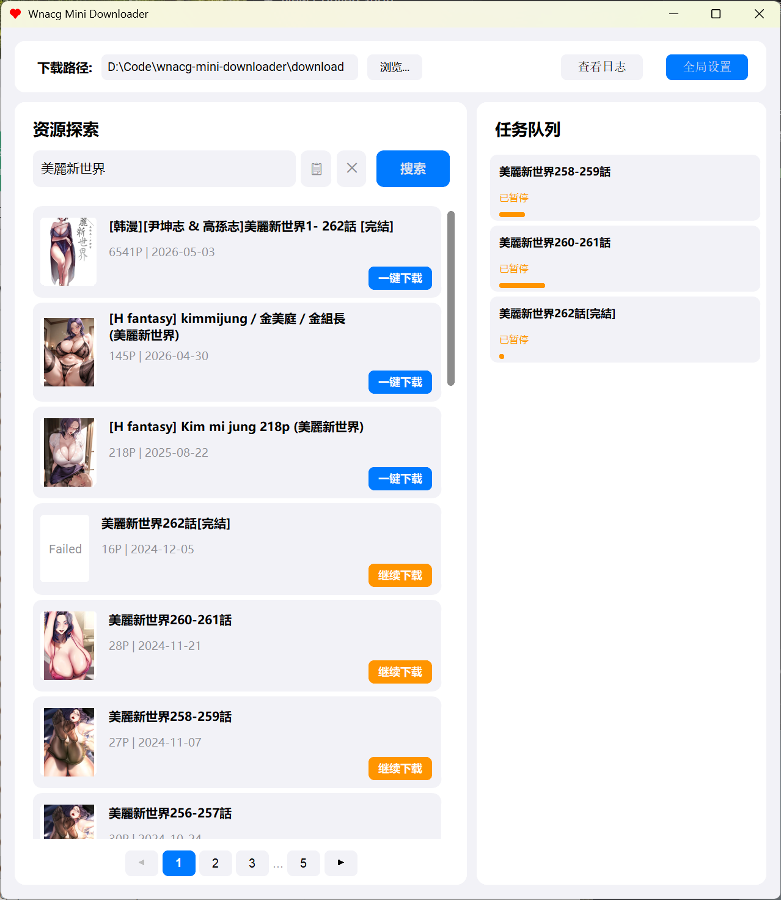
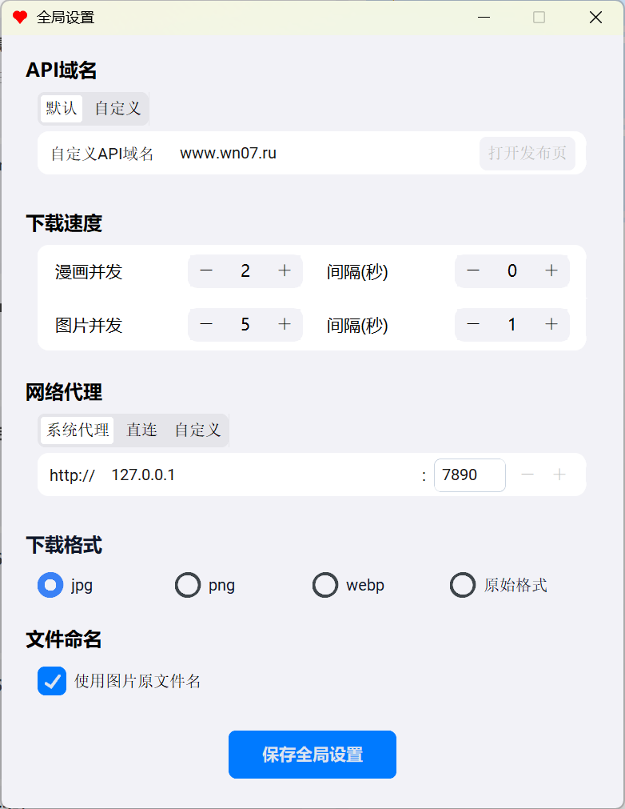

# Wnacg Mini Downloader


Wnacg Mini Downloader 是一款轻量级、高颜值、高性能的开源漫画下载器。  
采用现代化的 iOS HIG（Human Interface Guidelines）设计语言重构，为用户提供纯净且优雅的桌面端交互体验。

## 📸 界面预览 (Screenshots)


<br>


---

## 🌟 核心特性 (Features)

*   **🎨 现代美学设计**
    *   全局遵循 iOS HIG 设计规范，支持浅色/深色（Light/Dark）模式自适应。
    *   精美的圆角卡片、平滑的交互动画与原生的视觉反馈。
*   **⚡ 极速并发引擎**
    *   支持**多任务同时下载**与**单任务多图并发**，极致榨干带宽。
    *   可在设置中自由调节并发线程数和请求间隔，防封 IP。
*   **🔄 智能断点续传**
    *   支持意外关闭后的进度缓存，重新打开无缝继续下载。
    *   失败重试与“部分失败”状态智能监控，杜绝漏图。
*   **🌐 灵活的网络支持**
    *   支持自动读取系统代理，或手动配置 HTTP/HTTPS 代理。
    *   支持配置自定义 API 镜像域名，轻松绕过网络封锁。
*   **🖼️ 格式与画质优化**
    *   自动处理复杂格式转换，支持导出为高质量 JPEG、PNG 等格式。
    *   智能处理包含透明通道的图片，避免“黑底”渲染异常。

## 🚀 快速开始 (Quick Start)

### 1. 便携运行 (推荐)
前往 [Releases](#) 页面下载最新打包好的完整独立程序 `wnacg-mini-downloader.exe`，无需配置任何 Python 环境，双击即可直接运行！

### 2. 环境准备 (源码运行)
请确保您的设备上安装了 **Python 3.8** 或以上版本。

### 3. 克隆项目
```bash
git clone https://github.com/your-username/wnacg-mini-downloader.git
cd wnacg-mini-downloader
```

### 4. 安装依赖
强烈建议在虚拟环境中安装所需依赖：
```bash
pip install -r requirements.txt
```

### 5. 运行程序
```bash
python main.py
```
*(Windows 用户也可直接双击 `run.bat` 运行)*

## 🛠️ 配置说明 (Configuration)

点击主界面右上角的 **“全局设置”**，您可以配置：
*   **下载路径**：自定义漫画保存位置。
*   **下载速度限制**：设置漫画队列并发数、图片下载并发数及安全抓取间隔。
*   **网络代理**：配置您的本地代理地址（如 `127.0.0.1:7890`）。
*   **API 域名**：当默认官方域名不可用时，可切换至自定义备用镜像。

## 🤝 参与贡献 (Contributing)
非常欢迎任何形式的贡献！
如果您发现了 Bug 或有新功能的想法，请提交 Issue；如果您想直接参与开发，请 Fork 本仓库并提交 Pull Request。

## 📜 许可证 (License)
本项目采用 [MIT License](LICENSE) 开源协议。您可以自由地修改和使用。

> **免责声明**：本项目仅供学习与技术交流使用。用户使用本软件下载的任何内容，其版权与法律责任均由用户自行承担，与项目开发者无关。请在遵循当地法律法规及原网站用户协议的前提下使用。
